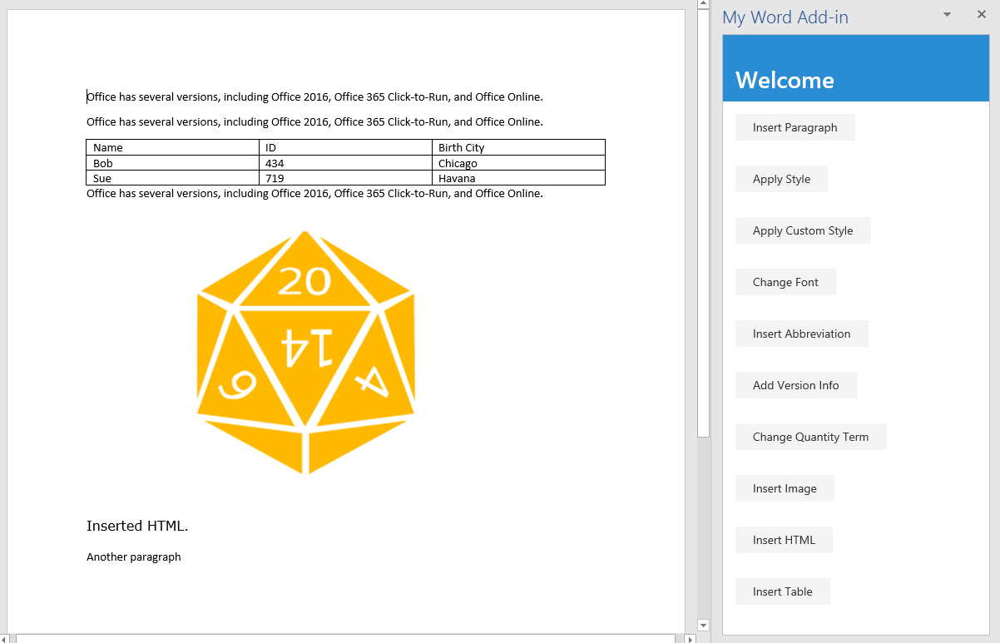

In this step of the tutorial, you'll learn how to insert images, HTML, and tables into the document.

## Insert an image

1. Open the project in your code editor. 
2. Open the file index.html.
3. Below the `div` that contains the `replace-text` button, add the following markup:

    ```html
    <div class="padding">            
        <button class="ms-Button" id="insert-image">Insert Image</button>            
    </div>
    ```

4. Open the app.js file.

5. Near the top of the file, just below the use-strict line, add the following line. This line imports a variable from another file. The variable is a base 64 string that encodes an image. To see the encoded string, open the base64Image.js file in the root of the project.

    ```js
    import { base64Image } from "./base64Image";
    ``` 

5. Below the line that assigns a click handler to the `replace-text` button, add the following code:

    ```js
    $('#insert-image').click(insertImage);
    ```

6. Below the `replaceText` function add the following function.

    ```js
    function insertImage() {
        Word.run(function (context) {
            
            // TODO1: Queue commands to insert an image.

            return context.sync();
        })
        .catch(function (error) {
            console.log("Error: " + error);
            if (error instanceof OfficeExtension.Error) {
                console.log("Debug info: " + JSON.stringify(error.debugInfo));
            }
        });
    }
    ``` 

7. Replace `TODO1` with the following code. Note that this line inserts the base 64 encoded image at the end of the document. (The `Paragraph` object also has an `insertInlinePictureFromBase64` method and other `insert*` methods. See the insertHTML method below for an example.)

    ```js
    context.document.body.insertInlinePictureFromBase64(base64Image, "End");
    ``` 

## Insert HTML

2. Open the file index.html.
3. Below the `div` that contains the `insert-image` button, add the following markup:

    ```html
    <div class="padding">            
        <button class="ms-Button" id="insert-html">Insert HTML</button>            
    </div>
    ```

4. Open the app.js file.

5. Below the line that assigns a click handler to the `insert-image` button, add the following code:

    ```js
    $('#insert-html').click(insertHTML);
    ```

6. Below the `insertImage` function add the following function.

    ```js
    function insertHTML() {
        Word.run(function (context) {
            
            // TODO1: Queue commands to insert a string of HTML.

            return context.sync();
        })
        .catch(function (error) {
            console.log("Error: " + error);
            if (error instanceof OfficeExtension.Error) {
                console.log("Debug info: " + JSON.stringify(error.debugInfo));
            }
        });
    }
    ``` 

7. Replace `TODO1` with the following code. Note:
   - The first line adds a blank paragraph to the end of the document. 
   - The second line inserts a string of HTML at the end of the paragraph; specifically two paragraphs, one formatted with Verdana font, the other with the default styling of the Word document. (As you saw in the `insertImage` method earlier, the `context.document.body` object also has the `insert*` methods.)

    ```js
    const blankParagraph = context.document.body.paragraphs.getLast().insertParagraph("", "After");
    blankParagraph.insertHtml('<p style="font-family: verdana;">Inserted HTML.</b></p><p>Another paragraph</p>', "End");
    ``` 

## Insert Table

1. Open the file index.html.
3. Below the `div` that contains the `insert-html` button, add the following markup:

    ```html
    <div class="padding">            
        <button class="ms-Button" id="insert-table">Insert Table</button>            
    </div>
    ```

4. Open the app.js file.

5. Below the line that assigns a click handler to the `insert-html` button, add the following code:

    ```js
    $('#insert-table').click(insertTable);
    ```

6. Below the `insertHTML` function add the following function.

    ```js
    function insertTable() {
        Word.run(function (context) {
            
            // TODO1: Queue commands to get a reference to the paragraph
            //        that will proceed the table.

            // TODO2: Queue commands to create a table and populate it with data.

            return context.sync();
        })
        .catch(function (error) {
            console.log("Error: " + error);
            if (error instanceof OfficeExtension.Error) {
                console.log("Debug info: " + JSON.stringify(error.debugInfo));
            }
        });
    }
    ``` 

7. Replace `TODO1` with the following code. Note that this line uses the `ParapgraphCollection.getFirst` method to get a reference ot the first paragraph and then uses the `Paragraph.getNext` method to get a reference to the second paragraph.

    ```js
    const secondParagraph = context.document.body.paragraphs.getFirst().getNext();
    ``` 

8. Replace `TODO2` with the following code. Note:
   - The first two parameters of the `insertTable` method specify the number of rows and columns.
   - The third parameter specifies where to insert the table, in this case after the paragraph.
   - The fourth parameter is a two-dimensional array that sets the values of the table cells.
   - The table will have plain default styling, but the `insertTable` method returns a `Table` object with many members, some of which can be used to style the table.

     ```js
    const tableData = [
            ["Name", "ID", "Birth City"],
            ["Bob", "434", "Chicago"],
            ["Sue", "719", "Havana"],
        ];
    secondParagraph.insertTable(3, 3, "After", tableData);
    ``` 

## Test the add-in


1. If the Git bash window, or Node.JS-enabled system prompt, from the previous stage tutorial is still open, enter Ctrl-C twice to stop the running web server. Otherwise, open a Git bash window, or Node.JS-enabled system prompt, and navigate to the **Start** folder of the project.

     > [!NOTE]
     > Although the browser-sync server reloads your add-in in the task pane every time you make a change to any file, including the app.js file, it does not retranspile the JavaScript, so you must repeat the build command in order for your changes to app.js to take effect. In order to do this, you need to kill the server process in so that you can get a prompt to enter the build command. After the build, you restart the server. The next few steps carry out this process.

1. Run the command `npm run build` to transpile your ES6 source code to an earlier version of JavaScript that is supported by all the hosts where Office Add-ins can run.
2. Run the command `npm start` to start a web server running on localhost.
4. Reload the task pane by closing it, and then on the **Home** menu, select **Show Taskpane** to reopen the add-in.
5. In the taskpane, choose **Insert Paragraph** at least three times to ensure that there are a few paragraphs in the document.
6. Choose the **Insert Image** button and note that an image is inserted at the end of the document.
7. Choose the **Insert HTML** button and note that two paragraphs are inserted at the end of the document, and that the first one has Verdana font.
8. Choose the **Insert Table** button and note that a table is inserted after the second paragraph.


    
